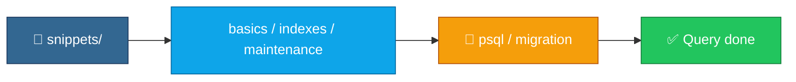

<p align="center">
  
</p>

<h1 align="center">sql-snippets</h1>

<p align="center">
  <strong>EN</strong> Useful PostgreSQL SQL snippets for everyday tasks<br/>
  <strong>PT</strong> Snippets SQL PostgreSQL úteis para o dia a dia
</p>

<p align="center">
  <a href="https://github.com/manansbdb/sql-snippets/blob/main/LICENSE"></a>
  
  
  <a href="#support--apoio"></a>
</p>

---

## What it does / Para que serve

| English | Português |
|---------|-----------|
| Handy **PostgreSQL snippets** for basics, indexes/EXPLAIN, and maintenance. | **Snippets PostgreSQL** para basics, indexes/EXPLAIN e manutenção. |
| Copy SQL into your migrations, runbooks, or `psql` sessions. | Copia o SQL para migrations, runbooks ou sessões `psql`. |



---

## Install / Instalação

### 1) Clone / Clona

```bash
git clone https://github.com/manansbdb/sql-snippets.git
cd sql-snippets
```

### 2) Use with psql / Usa com psql

```bash
psql "$DATABASE_URL" -f snippets/basics.sql
# or copy fragments into your migration tool
mkdir -p /path/to/docs/sql
cp snippets/*.sql /path/to/docs/sql/
```

### Requirements / Requisitos

- `git`
- Optional: PostgreSQL client (`psql`)

---

## Quick start / Início rápido

```bash
git clone https://github.com/manansbdb/sql-snippets.git
# open snippets/basics.sql / indexes-explain.sql / maintenance.sql
```

---

## Contents / Conteúdos

| Path | Purpose / Função |
|------|------------------|
| `snippets/basics.sql` | Everyday queries |
| `snippets/indexes-explain.sql` | Indexes + EXPLAIN |
| `snippets/maintenance.sql` | Vacuum / maintenance |
| `SUPPORT.md` | Donations / Doações |

---

## Project layout / Estrutura

```text
sql-snippets/
├── docs/banner.svg
├── snippets/basics.sql
├── snippets/indexes-explain.sql
├── snippets/maintenance.sql
├── SUPPORT.md
└── README.md
```

---

## Support / Apoio

Bitcoin donations welcome / Doações em Bitcoin bem-vindas:

```
bc1q0qfnlnxyum9u45stzxe0a7jnhtj4j0usfkqdjw
```

See [SUPPORT.md](./SUPPORT.md).

---

## License / Licença

[MIT](./LICENSE) © 2026 manansbdb
